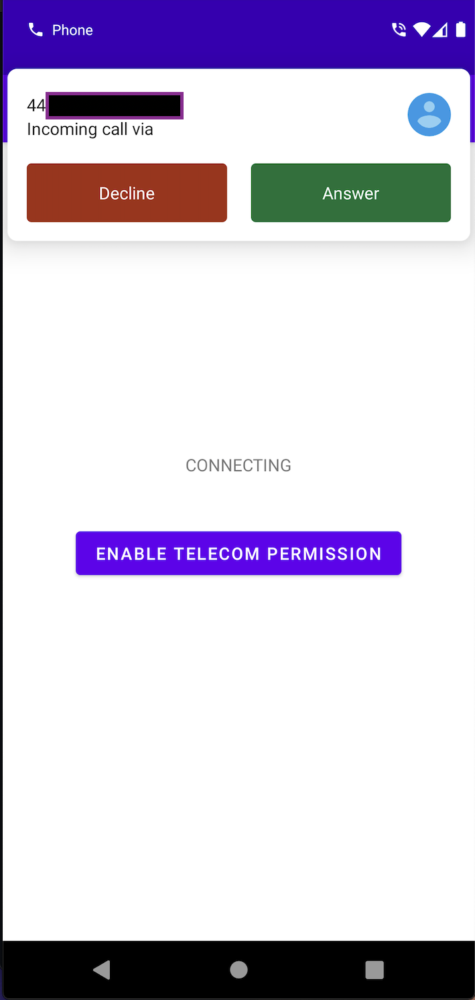
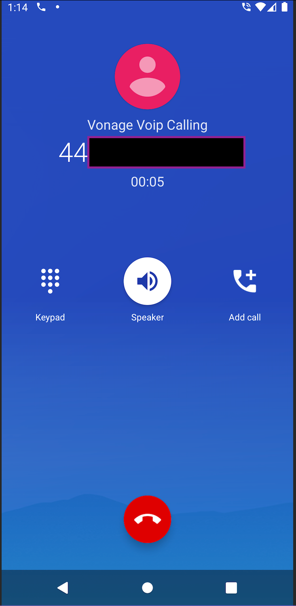

# Android Client SDK Push Notifications ConnectionService Sample

This is an Android Kotlin project that using the [Client SDK](https://developer.vonage.com/vonage-client-sdk/overview) to receive inbound calls from a phone with a [ConnectionService](https://developer.android.com/reference/android/telecom/ConnectionService) integration for push notifications.

## Welcome to Vonage

If you're new to Vonage, you can [sign up for a Vonage API account](https://dashboard.nexmo.com/sign-up?utm_source=DEV_REL&utm_medium=github&utm_campaign=) and get some free credit to get you started.

## Running the project

The push notifications in the project require set up with your Firebase account and your Vonage API account. See the [docs](https://developer.vonage.com/en/vonage-client-sdk/set-up-push-notifications/android) for more information.

Clone the project to your computer, using the terminal:

`git clone git@github.com:Vonage-Community/sample-client_sdk-android-connection_service.git`

Open the project in Android studio and rename the [app package](https://stackoverflow.com/a/29092698). This is required for you to successfully register the app with Firebase.

Then follow the steps in the [docs](https://developer.vonage.com/en/vonage-client-sdk/set-up-push-notifications/android) to get your application registered with Firebase and Vonage.

Add your JWT to the `ClientManager` class then run the app. Click the button to enable the telecom permissions for this app:

When you call your Vonage number you will see a banner if the device is unlocked:

When answer is clicked it will bring up the system UI:

## Getting Help

We love to hear from you so if you have questions, comments or find a bug in the project, let us know! You can either:

* Open an issue on this repository
* Tweet at us! We're [@VonageDev on Twitter](https://twitter.com/VonageDev)
* Or [join the Vonage Developer Community Slack](https://developer.nexmo.com/community/slack)

## Further Reading

* Check out the Developer Documentation at <https://developer.nexmo.com>